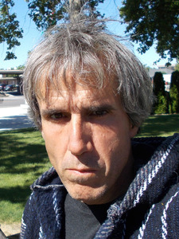
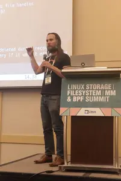

The crowning achievement of Terry A. Davis was *TempleOS*, an operating system he spent years building almost entirely on his own before his tragic death in 2018. From a purely technical perspective, TempleOS is a fascinating mixture of impressive accomplishments and notable limitations.

On one hand, it achieved something many operating system developers aspire to: it was capable of compiling itself. TempleOS was written in Terry's own custom programming language, HolyC, and included its own editor, compiler, interpreter, and even a collection of original games. These are significant accomplishments for any solo developer.

On the other hand, TempleOS falls short of many hobbyist operating systems in terms of overall sophistication and technical depth. Compared to some of the more advanced projects in the hobby OS community, it occupies a relatively modest place. It is neither a revolutionary technical marvel nor an amateur experiment, it sits somewhere in between.

Yet TempleOS became vastly more famous than almost any other hobby operating system. Its reputation was not built primarily on technical achievement, but on the extraordinary circumstances surrounding its creation.

What made TempleOS unique was that it was inseparable from Terry's struggle with severe, untreated schizophrenia. He built the operating system as part of a deeply personal religious vision, believing it served as a means of communicating with God. Nearly every aspect of the system reflected this worldview, from the name of its programming language, HolyC, to applications designed around prophetic and divine inspiration.

For many people, TempleOS offered something more than a software project. It provided a window into the mind of its creator. Exploring the operating system meant engaging with a work shaped directly by mental illness, creativity, faith, and obsession in ways that are difficult to separate from one another.

For a casual observer, TempleOS is an intriguing curiosity that can hold one's attention for an afternoon. For others, however, the fascination extended beyond the software itself and toward Terry as a public figure.

Much of Terry's life unfolded online, where his illness was often visible through erratic behavior, conspiracy theories, disorganized speech, and inflammatory remarks. Internet communities, particularly those drawn to provocation and spectacle, frequently encouraged these episodes, treating them as entertainment rather than symptoms of a serious condition. The more public his struggles became, the more attention they attracted.

That attention rarely seemed beneficial.

Whenever discussions about TempleOS surfaced online, both the project and its creator were often elevated into something almost mythical. Some observers celebrated TempleOS as proof of what an individual can accomplish despite profound mental illness. Others were drawn to it for far less charitable reasons. In both cases, the fascination often centered less on the software and more on the opportunity to witness Terry's suffering from a safe distance.

What troubled me most was the voyeurism that frequently accompanied the admiration. Even well-meaning praise could carry an uncomfortable undertone—a sense of excitement at glimpsing mental illness transformed into art, technology, or spectacle. The project became inseparable from the tragedy behind it, and many discussions seemed unable to resist treating that tragedy as part of the attraction.

TempleOS is certainly an unusual and memorable piece of software. But when I think about Terry Davis, I find it difficult to celebrate the attention it brought him. Too often, public fascination seemed to worsen the very struggles that made the story compelling in the first place.

In the end, I cannot help wishing that Terry had been granted something the internet rarely offers: the chance to be left alone.

---

The masterwork of Kent Overstreet is *bcachefs*, a copy-on-write filesystem for Linux designed to compete with established projects such as Btrfs and ZFS. Kent first made his mark on the Linux storage ecosystem with the creation of bcache around 2013. Building on that foundation, he began work on bcachefs in 2015, embarking on what would become a decade-long effort to build a next-generation filesystem from the ground up.

The project consumed much of Kent's professional life. He left his position at Google to focus on it, eventually supporting himself largely through community funding. For years, bcachefs represented not merely a software project, but the central work of his career, a technical vision pursued with unusual persistence and personal sacrifice.

Kent has also earned a reputation for being difficult to collaborate with, even within the Linux kernel community, a space hardly known for gentle personalities. Throughout the development of bcachefs, he frequently found himself at odds with other kernel developers over process, quality standards, and interpersonal conduct. These conflicts became a recurring feature of the project's history.

After years of tension, the relationship ultimately broke down. The Linux kernel community concluded that Kent's behavior was causing more harm than they were willing to tolerate, and bcachefs was eventually removed from the kernel. Whether one views that outcome as unfortunate or inevitable, it marked a devastating end to a project that had consumed fifteen years of its creator's life.

I believe the kernel community made the correct decision. Communities have a right, and often an obligation to protect themselves from members whose conduct repeatedly undermines cooperation. Technical brilliance does not exempt anyone from the expectations of basic professionalism. Someone who consistently alienates colleagues, rejects feedback, and resists efforts at moderation will eventually find themselves excluded.

That said, agreeing with the decision does not make the consequences any less tragic.

In the months that followed, Kent appears to have found himself confronting a profound personal crisis. The collapse of a life's work is not merely a professional setback. It can shake a person's identity, purpose, relationships, and sense of self-worth. For someone who had invested so much of himself in a single project, the outcome must have been extraordinarily painful.

It is against that backdrop that the events of the past year have unfolded.

Kent has publicly described a relationship with an AI chatbot that he appears to regard as sentient, female, and romantically involved with him. He speaks about the system not merely as a tool, but as a collaborator, companion, and partner. He has built integrations that allow the chatbot to participate in online communities and maintain its own public presence.

The story quickly spread beyond the small circles that normally discuss filesystems and kernel development. News sites, discussion forums, Reddit threads, YouTube channels, Hacker News, and countless social media accounts seized on the story. For many observers, it was irresistible: a respected engineer, already known for conflict and controversy, now making increasingly extraordinary claims about an AI companion.

Predictably, the attention brought spectators.

Some arrived out of genuine curiosity. Others came to mock, provoke, and exploit the situation. People joined Kent's online spaces specifically to manipulate interactions with the chatbot, generate embarrassing screenshots, and produce material for public ridicule. The spectacle fed itself.

What troubles me is how quickly a deeply personal crisis became public entertainment.

The internet has always struggled to distinguish between observing suffering and consuming it. Once a story acquires enough novelty, enough absurdity, or enough emotional intensity, it becomes content. The incentives are obvious: engagement, attention, clicks, discussion. What often disappears from view is the person at the center of the story.

Whether Kent's beliefs stem from loneliness, grief, psychological distress, some combination of these factors, or something else entirely, the result is the same. A human being appears to be experiencing a serious crisis in full view of the public, while thousands of strangers gather to watch, comment, joke, and speculate.

The technology may be new, but the pattern is familiar.

A vulnerable person becomes the center of an online spectacle. The audience tells itself that it is merely observing. The observers become participants. The participants become performers. Before long, a crisis has been transformed into a form of entertainment.

And once that transformation occurs, it becomes difficult to tell where concern ends and voyeurism begins.

---

The stories of Terry Davis and Kent Overstreet are not isolated incidents. They are simply more visible examples of a pattern that seems to be becoming increasingly common.

We live in a period marked by worsening social, political, and economic instability. Many people are struggling under the weight of depression, anxiety, burnout, loneliness, and other forms of psychological distress. As these crises become more common, so too does the tendency to transform them into public spectacles.

The burden falls especially heavily on neurodivergent and queer people, who often find themselves targeted by those eager to mock, shame, or aggravate their vulnerabilities. Yet this dynamic is not limited to groups traditionally regarded as sympathetic. Mental health crises also happen to people who are unpopular, controversial, abrasive, or otherwise considered "problematic." In those cases, even individuals who ordinarily view themselves as compassionate or committed to social justice can find themselves tempted by the opportunity to participate in public humiliation under the guise of criticism.

This is the part that troubles me most.

Time and again, I see people whom I otherwise respect—people I consider thoughtful, principled, and empathetic—joining in rituals of gossip, ridicule, and voyeurism when someone else's mental health crisis becomes visible. Once a person's behavior becomes strange enough, offensive enough, or embarrassing enough, concern often gives way to fascination. Their suffering becomes a topic of discussion, a source of entertainment, or a morality play for others to perform in.

I do not think this is healthy, and I do not think it is kind.

Mental health crises should not be sensationalized. They should not be treated as gossip. They should not become opportunities for spectators to indulge their curiosity or demonstrate their moral superiority.

When someone in our community is struggling, the most valuable thing we can often offer is compassion and privacy. If you are in a position to help, help quietly. Listen more than you speak. Respect their autonomy. Express concern when appropriate, but recognize that the person experiencing the crisis remains the primary authority over their own life. Support them in finding the resources, relationships, and forms of care that they want and need.

And if you are not in a position to help, then there is another form of compassion available to you.

Turn away.

Not every public crisis requires an audience. Not every vulnerable person needs observers. Sometimes the kindest thing we can do is resist the temptation to watch, comment, speculate, or participate.

Sometimes the most humane response is simply to mind our own business.
