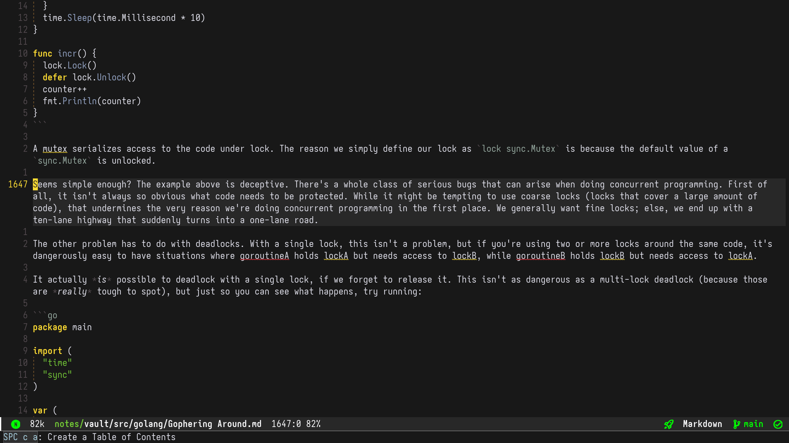

I am a soft wrapping guy when it comes to editing markdown files.
If you're using Evil mode in your Emacs like me, the normal j and k commands move by logical lines, not visual (wrapped) lines. I didn't want to use gj and gk to move by visual lines like vim. I wanted 5j/5k to move five logical lines while plain j/k moves one visual line. So added a little tweak to my config.el file:

```elisp
(after! evil
  (evil-define-motion my/evil-next-line (count)
    :type line
    (if count
        (evil-next-line count)
      (evil-next-visual-line 1)))

  (evil-define-motion my/evil-previous-line (count)
    :type line
    (if count
        (evil-previous-line count)
      (evil-previous-visual-line 1)))

  (map! :n "j" #'my/evil-next-line
        :n "k" #'my/evil-previous-line))
```

I only use it to skim through long text lines. To jump edit I use `Avy` package which comes by default with latest Doom Emacs.


Pressing `g s SPC` starts a jump to the next occurrence of a space character. Since every word is separated by spaces, it becomes an easy way to jump around the visible text.
