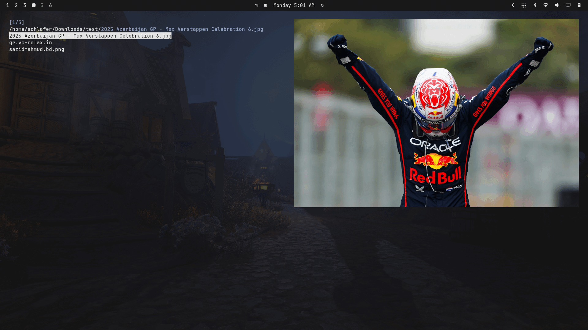

## mini-fm

I’ve always liked doing as much as possible from the terminal, but I wanted a file manager that matched the way I actually work. Instead of trying to configure an existing one until it felt right, I decided to build my own.

**mini-fm** is my small, keyboard-driven file manager for the terminal, written in Go. It started as a simple experiment and gradually turned into a proper little tool that I use for navigating files, opening things in my editor, searching through directories, and handling everyday file operations.

I wanted the interface to stay simple and fast. There’s no configuration file to maintain and no complicated setup. You launch it and start using it. Along the way, I added things I personally find useful, like fuzzy filtering, multi-select, inline rename and copy, shell commands, syntax-highlighted text previews, directory previews, and image previews through the Kitty graphics protocol.

The project has also been a nice excuse to learn more about **Go and terminal UI development**. A lot of the fun has been in figuring out the small details that you normally don't think about when using a finished application: handling files safely, integrating with `$EDITOR`, dealing with terminal capabilities, and making keyboard-driven interactions feel natural.

It’s still a work in progress, but that’s part of the point. I’m building it around my own workflow and using it as a place to experiment, learn, and slowly turn those experiments into something useful.

**Source:** [GitHub](https://github.com/schlafer/mini-fm)
